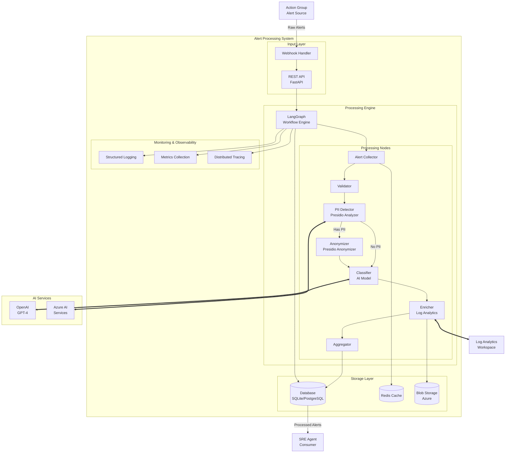

# Alert Processing System

An AI Ops alert processing system built with **LangGraph** and **Presidio** for collecting, analyzing, categorizing, and enriching alerts for SRE automation.


## 🏗️ Architecture Overview

The system processes alerts through a sophisticated LangGraph workflow that includes:

- **Alert Collection** from Azure Action Groups and other sources
- **PII Detection & Anonymization** using Microsoft Presidio
- **AI-Powered Classification** with GPT-4 integration
- **Log Analytics Enrichment** for contextual data
- **Incident Correlation** for related event detection
- **SRE Agent Integration** for automated response

## 🚀 Quick Start

### Prerequisites

- Python 3.9 or higher
- Azure subscription (for Log Analytics integration)
- OpenAI API key (for classification)
- Redis (optional, for caching)

### Installation

1. **Clone the repository:**
   ```bash
   git clone https://github.com/DevelopingOutOfMyMind/Alert_Processing.git
   cd Alert_Processing
   ```

2. **Create virtual environment:**
   ```bash
   python -m venv venv
   source venv/bin/activate  # On Windows: venv\Scripts\activate
   ```

3. **Install dependencies:**
   ```bash
   pip install -e .
   ```

4. **Install development dependencies:**
   ```bash
   pip install -e ".[dev]"
   ```

5. **Install Spacy model for Presidio:**
   ```bash
   python -m spacy download en_core_web_sm
   ```

6. **Configure environment:**
   ```bash
   cp .env.example .env
   # Edit .env with your configuration values
   ```

### Configuration

Create a `.env` file with the following configuration:

```env
# Azure Configuration
AZURE_TENANT_ID=your_tenant_id
AZURE_CLIENT_ID=your_client_id
AZURE_CLIENT_SECRET=your_client_secret
AZURE_SUBSCRIPTION_ID=your_subscription_id
AZURE_LOG_ANALYTICS_WORKSPACE_ID=your_workspace_id

# OpenAI Configuration
OPENAI_API_KEY=your_openai_api_key
OPENAI_MODEL=gpt-4-turbo-preview

# Application Configuration
ENVIRONMENT=development
LOG_LEVEL=INFO
PII_ANONYMIZATION_ENABLED=true
```

## 📖 Usage

### Server Mode

Start the FastAPI server:

```bash
alert-processor serve
```

The API will be available at `http://localhost:8000` with interactive docs at `http://localhost:8000/docs`.

### CLI Mode

Process a single alert from file:

```bash
alert-processor process-file alert_data.json --source action_group
```

Generate and process a test alert:

```bash
alert-processor test-alert
```

View configuration:

```bash
alert-processor config
```

### API Usage

Submit an alert via REST API:

```bash
curl -X POST "http://localhost:8000/api/v1/alerts" \
  -H "Content-Type: application/json" \
  -d '{
    "data": {
      "context": {
        "name": "High CPU Usage",
        "description": "CPU usage exceeded 90% threshold",
        "severity": "high",
        "resourceName": "web-server-01"
      }
    },
    "source": "action_group"
  }'
```

## 🏛️ System Architecture

### Conceptual Architecture



### Processing Flow

The system follows this sequence for each alert:

1. **Collection**: Parse incoming alerts from various sources
2. **Validation**: Validate schema and check for duplicates
3. **PII Detection**: Scan content for personally identifiable information
4. **Anonymization**: Apply anonymization if PII is detected
5. **Classification**: Categorize and assess urgency using AI
6. **Enrichment**: Query Log Analytics for related context
7. **Correlation**: Find related incidents and patterns
8. **Storage**: Persist processed alert for SRE consumption

## 🧩 Key Components

### Alert Models

- **RawAlert**: Incoming alert data structure
- **ProcessedAlert**: Enhanced alert after processing
- **WorkflowState**: LangGraph state management

### Processing Components

- **AlertCollector**: Multi-source alert ingestion
- **PIIDetector**: Presidio-based PII detection
- **AlertClassifier**: AI-powered categorization
- **LogAnalyticsEnricher**: Azure Log Analytics integration
- **IncidentCorrelator**: Cross-alert correlation

### Workflow Engine

- **LangGraph-based**: State machine workflow orchestration
- **Error Handling**: Retry logic and failure recovery
- **Monitoring**: Comprehensive observability

## 🔒 Security & Privacy

### PII Protection

- **Automatic Detection**: Presidio scans for 20+ entity types
- **Configurable Anonymization**: Token replacement or fake data
- **Audit Trail**: Track anonymization operations
- **Compliance Ready**: GDPR, CCPA, HIPAA considerations

### Security Features

- **Authentication**: Azure AD integration ready
- **Encryption**: TLS for data in transit
- **Access Control**: Role-based permissions
- **Audit Logging**: Complete operation audit trail

## 📊 Monitoring & Observability

- **Structured Logging**: JSON-formatted application logs
- **Metrics Collection**: Processing performance metrics
- **Distributed Tracing**: Request flow tracking
- **Health Checks**: Service availability monitoring

## 🧪 Testing

Run the test suite:

```bash
pytest
```

Run tests with coverage:

```bash
pytest --cov=alert_processing --cov-report=html
```

Run specific test categories:

```bash
pytest -m unit          # Unit tests only
pytest -m integration   # Integration tests only
pytest -m "not slow"    # Exclude slow tests
```

## 📦 Deployment

### Docker Deployment

```bash
docker build -t alert-processing .
docker run -p 8000:8000 --env-file .env alert-processing
```

### Azure Container Instance

```bash
az container create \
  --resource-group myResourceGroup \
  --name alert-processing \
  --image alert-processing:latest \
  --environment-variables AZURE_CLIENT_ID=xxx
```

### Kubernetes

```yaml
apiVersion: apps/v1
kind: Deployment
metadata:
  name: alert-processing
spec:
  replicas: 3
  selector:
    matchLabels:
      app: alert-processing
  template:
    metadata:
      labels:
        app: alert-processing
    spec:
      containers:
      - name: alert-processing
        image: alert-processing:latest
        ports:
        - containerPort: 8000
```

## 🔧 Development

### Project Structure

```
Alert_Processing/
├── src/alert_processing/           # Main application code
│   ├── collectors/                 # Alert collection components
│   ├── analyzers/                  # PII detection & classification
│   ├── enrichers/                  # Log Analytics enrichment
│   ├── workflows/                  # LangGraph workflows
│   ├── models/                     # Pydantic models
│   ├── app.py                      # FastAPI application
│   ├── cli.py                      # Command line interface
│   └── config.py                   # Configuration management
├── tests/                          # Test suite
├── docs/                           # Documentation
├── config/                         # Configuration files
├── scripts/                        # Utility scripts
└── pyproject.toml                  # Project configuration
```

### Code Quality

The project uses:

- **Black**: Code formatting
- **isort**: Import sorting
- **flake8**: Linting
- **mypy**: Type checking
- **pre-commit**: Git hooks

Install pre-commit hooks:

```bash
pre-commit install
```

## 🤝 Contributing

1. Fork the repository
2. Create a feature branch (`git checkout -b feature/amazing-feature`)
3. Make your changes
4. Run tests and quality checks
5. Commit your changes (`git commit -m 'Add amazing feature'`)
6. Push to the branch (`git push origin feature/amazing-feature`)
7. Open a Pull Request

## 📋 Roadmap

- [ ] Database persistence layer
- [ ] Advanced correlation algorithms
- [ ] Custom AI model training
- [ ] Multi-tenant support
- [ ] Grafana dashboards
- [ ] Slack/Teams integrations
- [ ] Advanced PII anonymization strategies
- [ ] Real-time alert streaming

## 📄 License

This project is licensed under the MIT License - see the [LICENSE](LICENSE) file for details.

## 🆘 Support

- **Documentation**: [GitHub Wiki](https://github.com/DevelopingOutOfMyMind/Alert_Processing/wiki)
- **Issues**: [GitHub Issues](https://github.com/DevelopingOutOfMyMind/Alert_Processing/issues)
- **Discussions**: [GitHub Discussions](https://github.com/DevelopingOutOfMyMind/Alert_Processing/discussions)

## 🙏 Acknowledgments

- **Microsoft Presidio** for PII detection capabilities
- **LangChain/LangGraph** for workflow orchestration
- **FastAPI** for the excellent web framework
- **Azure** for cloud services integration

---

**Built with ❤️ for SRE teams everywhere**