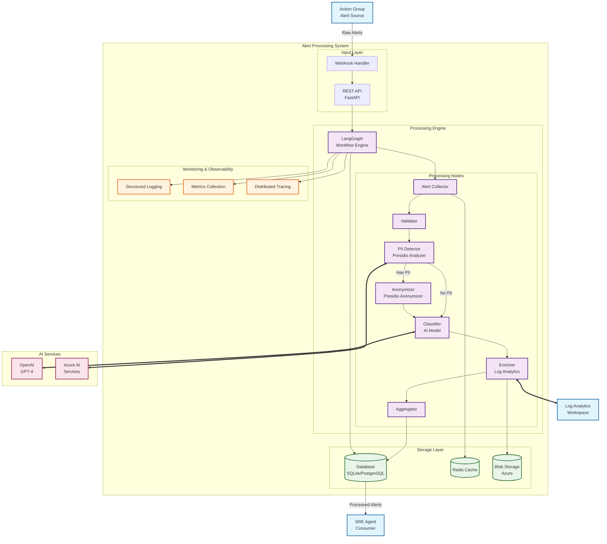

# Alert Processing System - Architecture Documentation

## System Architecture Overview

This document provides a comprehensive overview of the Alert Processing System architecture, including conceptual diagrams and processing workflows.

## Conceptual Architecture

The following diagram shows the high-level architecture of the Alert Processing System:

## Architecture Components

### Input Layer
- **REST API**: FastAPI-based web service for receiving alerts
- **Webhook Handler**: Specialized endpoint for Azure Action Group webhooks

### Processing Engine
- **LangGraph Workflow Engine**: Orchestrates the entire alert processing pipeline
- **Alert Collector**: Parses incoming alerts from various sources
- **Validator**: Ensures alert data integrity and checks for duplicates
- **PII Detector**: Uses Microsoft Presidio to identify sensitive information
- **Anonymizer**: Applies anonymization rules to protect PII
- **Classifier**: AI-powered categorization and urgency assessment
- **Enricher**: Integrates with Azure Log Analytics for contextual data
- **Aggregator**: Consolidates processed alert data

### Storage Layer
- **Database**: Persistent storage for processed alerts (SQLite/PostgreSQL)
- **Redis Cache**: High-speed caching for recent alerts and metadata
- **Azure Blob Storage**: Long-term storage for large datasets and logs

### External Integrations
- **OpenAI GPT-4**: Powers the AI classification engine
- **Azure AI Services**: Supports PII detection capabilities
- **Azure Log Analytics**: Provides enrichment data from operational logs

### Monitoring & Observability
- **Structured Logging**: JSON-formatted application logs
- **Metrics Collection**: Performance and operational metrics
- **Distributed Tracing**: Request flow tracking across components

## Data Flow

1. **Alert Ingestion**: External systems send alerts to the webhook handler
2. **Initial Processing**: Alerts are collected, validated, and queued
3. **PII Protection**: Content is scanned and anonymized if necessary
4. **AI Classification**: Alerts are categorized and assigned urgency scores
5. **Enrichment**: Additional context is gathered from Log Analytics
6. **Storage**: Processed alerts are stored for SRE consumption
7. **Monitoring**: All operations are logged and traced for observability

## Security Considerations

- All sensitive data is automatically detected and anonymized
- API endpoints are protected with input validation and rate limiting
- External connections use secure authentication and encryption
- Comprehensive audit logging tracks all processing operations

## Scalability Features

- Asynchronous processing supports high alert volumes
- Redis caching reduces database load
- Modular architecture allows independent scaling of components
- Background processing prevents API blocking