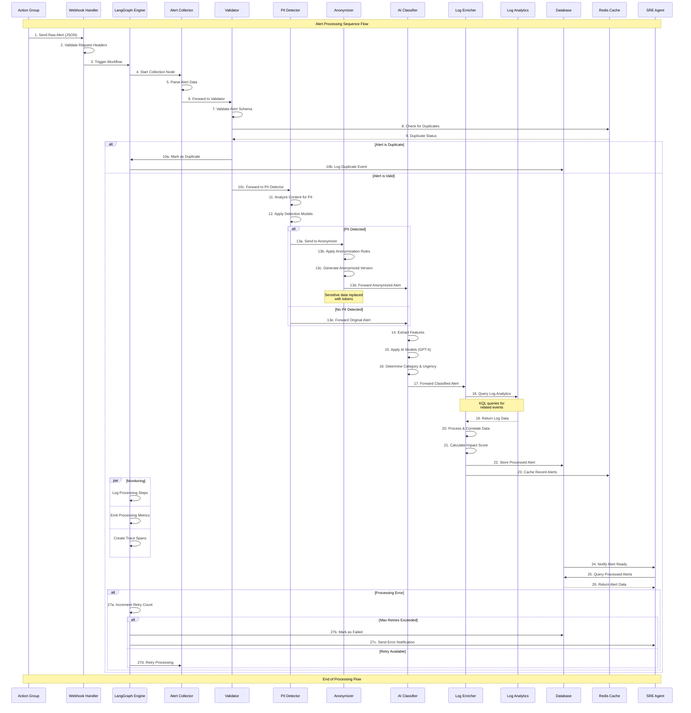

# Alert Processing Workflow - Sequence Documentation

## Processing Flow Overview

This document details the step-by-step sequence of how alerts are processed through the Alert Processing System, from initial ingestion to final storage.

## Detailed Sequence Flow

The following diagram shows the complete alert processing sequence:

## Processing Phases

### 1. Alert Ingestion (Steps 1-3)

**Purpose**: Receive and validate incoming alerts from external sources.

- **Step 1**: Azure Action Group sends alert via webhook
- **Step 2**: Webhook handler validates request headers and authentication
- **Step 3**: LangGraph workflow engine is triggered to begin processing

**Key Validations**:
- Request signature verification
- Payload size limits
- Basic schema validation

### 2. Collection Phase (Steps 4-6)

**Purpose**: Parse and normalize alert data from different sources.

- **Step 4**: Alert Collector node activated in LangGraph
- **Step 5**: Raw alert data parsed according to source format
- **Step 6**: Parsed alert forwarded to validation stage

**Supported Sources**:
- Azure Action Groups
- Azure Monitor
- Custom webhook formats
- Generic alert formats

### 3. Validation Phase (Steps 7-10)

**Purpose**: Ensure alert integrity and prevent duplicate processing.

- **Step 7**: Schema validation using Pydantic models
- **Step 8**: Duplicate check against Redis cache
- **Step 9**: Cache returns duplicate status
- **Step 10**: Branching logic based on validation results

**Validation Checks**:
- Required field presence
- Data type validation
- Security input validation
- Duplicate detection

### 4. PII Detection Phase (Steps 11-13)

**Purpose**: Identify and protect personally identifiable information.

- **Step 11**: Content analysis using Presidio
- **Step 12**: Apply trained PII detection models
- **Step 13**: Conditional anonymization based on findings

**PII Types Detected**:
- Email addresses
- Phone numbers
- Credit card numbers
- Social security numbers
- IP addresses
- Personal names

### 5. Classification Phase (Steps 14-16)

**Purpose**: Categorize alerts and assess urgency using AI.

- **Step 14**: Feature extraction from alert content
- **Step 15**: AI model inference using GPT-4
- **Step 16**: Category assignment and urgency scoring

**Classification Categories**:
- Infrastructure
- Application
- Security
- Performance
- Network
- Database

### 6. Enrichment Phase (Steps 17-21)

**Purpose**: Gather additional context from operational data.

- **Step 17**: Execute KQL queries against Log Analytics
- **Step 18**: Retrieve related log data
- **Step 19**: Process and correlate findings
- **Step 20**: Calculate overall impact score

**Enrichment Sources**:
- Azure diagnostics logs
- Performance metrics
- Security events
- Application logs

### 7. Storage Phase (Steps 22-23)

**Purpose**: Persist processed alert data for consumption.

- **Step 22**: Store complete processed alert in database
- **Step 23**: Cache recent alerts for fast retrieval

**Storage Optimization**:
- Indexed by timestamp and severity
- Compressed for long-term storage
- Cached for real-time access

### 8. SRE Integration (Steps 24-26)

**Purpose**: Make processed alerts available to SRE systems.

- **Step 24**: Notification sent to SRE agent
- **Step 25**: SRE queries for processed alerts
- **Step 26**: Processed alert data returned

## Error Handling & Resilience

### Retry Logic (Step 27)
- **Transient Failures**: Automatic retry with exponential backoff
- **Permanent Failures**: Alert marked as failed and escalated
- **Max Retries**: Configurable limit to prevent infinite loops

### Error Categories
1. **Network Errors**: Connectivity issues with external services
2. **Validation Errors**: Malformed or invalid alert data
3. **Processing Errors**: Algorithm failures or resource constraints
4. **Storage Errors**: Database or cache connectivity issues

### Monitoring Points
- **Processing Duration**: Track time spent in each phase
- **Error Rates**: Monitor failure rates per component
- **Throughput**: Measure alerts processed per minute
- **Queue Depth**: Track backlog size

## Performance Characteristics

### Processing Times (Typical)
- **Collection**: < 100ms
- **Validation**: < 50ms
- **PII Detection**: 200-500ms
- **Classification**: 1-3 seconds (AI inference)
- **Enrichment**: 500ms-2 seconds (Log Analytics queries)
- **Storage**: < 100ms

### Scalability Limits
- **Concurrent Alerts**: 10-50 (configurable)
- **Queue Size**: 1000 alerts
- **Retention**: 30 days (configurable)
- **Cache Size**: 10,000 recent alerts

## Security Checkpoints

1. **Input Validation**: All incoming data validated for security threats
2. **PII Protection**: Automatic detection and anonymization
3. **Query Sanitization**: KQL injection prevention
4. **Audit Logging**: Complete processing trail recorded
5. **Error Sanitization**: Sensitive data removed from error messages

## Integration Points

### Upstream Systems
- **Azure Action Groups**: Primary alert source
- **Azure Monitor**: Direct monitoring alerts
- **Custom Systems**: Via webhook API

### Downstream Systems  
- **SRE Dashboards**: Real-time alert visualization
- **Incident Management**: Automated ticket creation
- **Notification Systems**: Email, Slack, Teams integration
- **Analytics Platforms**: Historical analysis and reporting